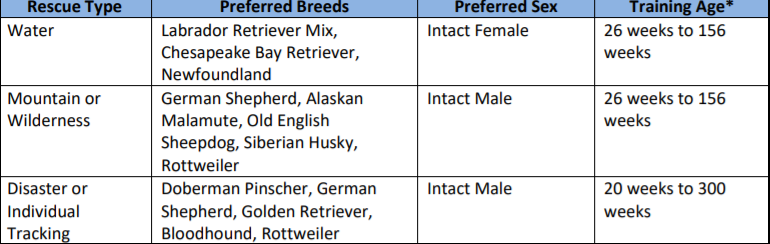
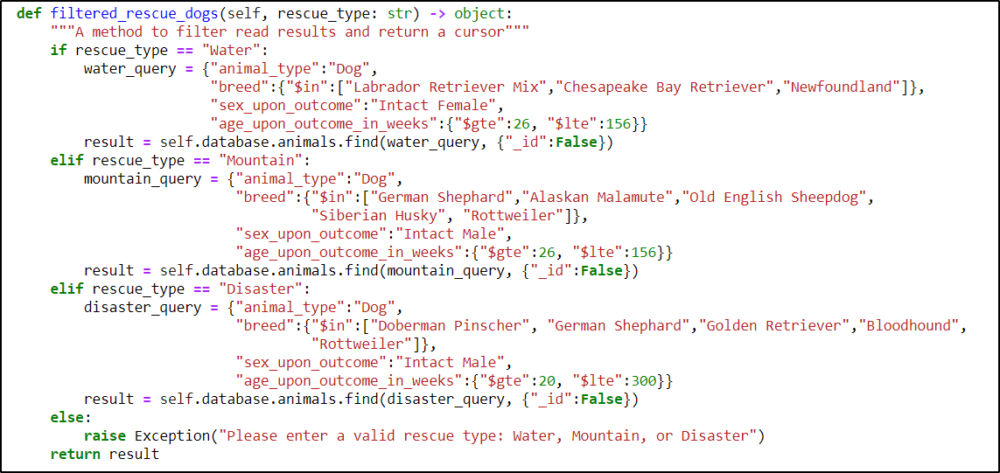

<h1>Rescue Animal Search Dashboard</h1>

This application generates a user dashboard for Grazioso Salvare’s users to search for rescue animals 
based on the rescue type. Grazioso Salvare trains dogs for three rescue types, water, mountain, and disaster. Certain breeds, genders, and ages are better for each rescue type. 
The table below describes the characteristics of dogs that train for each rescue type.
 
 

 
 
The user dashboard contains a table that allows users to filter rescue animals by their compatible rescue type. 
The dashboard also includes a geolocation chart and a pie chart to update dynamically with filter options. 
The screencasts below provides a demonstration of the dashboard’s filter options.
 
 

 

<h2>Motivation</h2>
The project exists to simplify searching for rescue animals. Non-technical users can easily query the mongo database for rescue dogs. 
The widgets show the percentage of rescue dogs belonging to each breed. The geolocation chart shows the dog’s name and location. 
The user dashboard allows users to quickly find trained rescue animals for water, mountain, and disaster rescue. 
 
<h2>Tools and Installation</h2>
Install MongoDB if the database is not running. The database will not be continuously running since this is a school project. 
A non-relational database was great for this project to allow Grazioso Salvare to change the data type associated with animal information. 
Non-relational databases also enhance search performance. MongoDB will also enable scalability as the business grows. 
MongoDB was a good option for use with Python due to the pymongo module discussed below. 
 
1.Install MongoDB from the <a href="https://docs.mongodb.com/manual/installation/">download page</a>.
 
Next, install dash dependencies. Dash is an open-source Python framework used primarily for building analytical web applications (Tutorialpoint, 2021). Dash was a powerful, user-friendly option for developing this data-driven application. Dash enabled the development of data visualizations and interactivity in Grazioso Salvare’s dashboard. 
 
 
2. Install Dash and its dependencies with the following commands:
<ul>
  <li><code>pip install dash</code></li>
  <li><code>pip install jupyter-dash</code></li>
  <li><code>pip install jupyter-plotly-dash</code></li>
  <li><code>pip install dash-leaflet</code></li>
  <li><code>pip install pandas</code></li>
</ul>  
</body>
</html>
 
Next, install pymongo. The pymongo module provides user-friendly compatibility between Python and MongoDB. 
The pymongo module allows users to establish database connections, work with collections and documents, work with encryption, and manipulate MongoDB cursor objects.
 
 
3. <code>pip install pymongo</code>
 
 
Finally, install jupyter to load and execute jupyter notebooks. 
 
 
4. <code>pip install jupyterlab</code> 
 
<h3>Getting Started</h3>
Follow the steps below to begin using this project.
 
<html>
   <body>
      <h4>Set up the database if it is not running.</h4>
      <ol type = "1">
         <li>Download the dataset included with the project files.</li>
         <li>Initialize MongoDB with the command <code>mongod_ctl start-noauth</code> (note: write down the port number)</li>
         <li>Navigate to the directory with the dataset <code>cd /directory/path</code></li>
         <li><code>mongoimport --port insert port --type csv --db AAC --collection animals --headerline --file ./aac_shelter_outcomes.csv</code> </li>
         <li>Create the admin account 
             </li>
         <li>Enable user authentication for the database 
            </li>
         <li>Create the user account. (Note: Remember to change the password in the dashboard script when instantiating the CRUD module).
             </li>
      </ol>
   </body>
</html>
 
<html>
   <body>
      <h4>Open the dashboard script in jupyter.</h4>
      <ol type = "1">
         <li>Type jupyter notebook at the terminal</li>
         <li>Locate and open the project in jupyter (be sure the CRUD module is in the same folder as the dashboard script).</li>
         <li>Change the password in the line of code below. 
              </li>
         <li>Execute the dashboard script.</li>
      </ol>
   </body>
</html>
 
<h3>Usage and Features</h3>
The dashboard logo includes an anchor to <a href="https://www.snhu.edu/">my university's homepage</a>. 
Click the logo to launch the website. You will see the image below as the homepage. 
 

 
The dashboard filters rescue dogs by rescue type as shown in the project demonstration. 
 
The dashboard also shows the animal’s name and location in the geolocation chart. 
 
The dashboard utilizes two methods from the CRUD.py module. 
The “read_all” method brings in all results from the database. 
The “filtered_rescue_dogs” method returns the query results based on the rescue type. 
Code examples of these methods are below. The CRUD module also contains create, update, and delete methods that may be incorporated into the dashboard in future releases. 
 

 

 

 

<h2>Project Steps and Challenges</h2>
<html>
   <body>
      <h4>The steps to completing this project are outlined below.</h4>
      <ol type = "1">
         <li>Setup the MongoDB database (refer to the steps listed above in getting started).</li>
         <li>Create the python CRUD module using pymongo. 
             This module contains methods to create, read, update, and delete documents. 
             The CRUD module also includes a method to filter rescue dogs by rescue type.</li>
         <li>Create a test script to test the CRUD module.</li>
         <li>Create the dashboard script using Dash. Import the CRUD module to access query methods.</li>
      </ol>
   </body>
</html>
 
The development of this project was straightforward and did not generate many obstacles. 
A few syntax errors in the dash script took additional time to find because they were in a callback and did not generate error messages. 
The error arose because the callback used to implement the filter options had an additional comma at the end. 
The dashboard loaded. However, it did not filter options properly. 
The other challenge was resizing the widgets and chart to be the same width as the page to avoid additional whitespace between the logo section and the chart. 
Adding a horizontal scrollbar to the table and resizing the widgets to match the table width resolved this issue. 
 

<h2>Project Reflection Questions</h2>
<h3>How do you write programs that are maintainable, readable, and adaptable?</h3>

Coding best practices outline ways for developers to maintain readable and adaptable code. 
Some of these practices include modularizing code, maintaining code documentation, commenting code, and following styling conventions consistent with the rest of the project. 
The CRUD Python module in this project followed the PEP8 style guide. 
The methods in this module are reusable and can work with other databases by changing the database name and authentication in the class constructor.

 
<h3>How do you approach a problem as a computer scientist?</h3>

The incremental development approach worked well for this project. 
I started by creating the database, setting up database authentication, and incorporating indexes to enhance query speed. 
I developed the CRUD python module next using pymongo to create a layer between the database and the user dashboard. 
Importing the CRUD module in my dashboard script provided a convenient way to return query results to the user. 
The iterative and incremental approach used in the Agile development methodology has worked well in this project and projects from previous courses. 
I will apply MongoDB’s more advanced features, such as data aggregation pipelines, to create databases that meet user needs in the future.

  
<h3>What do computer scientists do, and why does it matter? How does this type of project help companies accomplish their work?</h3>

Well, my answer to this question may be biased. 
However, I believe computer scientists make the world a better place. 
Computer scientists are responsible for some of this century’s best innovations. 
The internet and big data simplified research and made vast amounts of information readily available to anyone interested. 
Advances in computer architecture have made it possible for data scientists to store increasing amounts of data and run computationally expensive neural networks on data to gain valuable insight about companies, civilizations, and the world around us. 
Most people cannot go one day without encountering a device designed by a software developer. 
Security specialists keep data safe and protect countries from cyberattacks. 
Data analysts help identify trends in historical data that we may not have understood otherwise. 
Furthermore, computer scientists are in demand by almost every industry thanks to the endless possibilities of technology. 
This project simplified database querying and data visualizations for non-technical users.

 

<h2>Roadmap/Additional Features</h2>
<html>
   <body>
      <h4>Additional features to add to the dashboard are listed below.</h4>
      <ol type = "1">
         <li><bold>Administrator authentication:</bold> This feature will allow Grazioso Salvare employees to delete, update, and create documents in the database via the user interface. 
             There should be a separate login for these privileges so clients cannot alter the database’s state. </li>
         <li<bold>Create:</bold> The create feature will allow Grazioso Salvare administrators to add additional animals via the user interface. 
             This feature will allow non-technical users to manage the database.</li>
         <li><bold>Update:</bold> The update feature will allow Grazioso Salvare administrators to update animal information via the user interface. 
             This feature will also help non-technical users manage the database.</li>
         <li><bold>Delete:</bold> The delete feature will allow Grazioso Salvare administrators to delete animals from the database via the user interface. 
             This feature will help non-technical users manage the database. </li>
         <li><bold>The ability to book a rescue animal via the user interface:</bold> 
             This feature will change the animal’s status to unavailable after booking.</li>
      </ol>
   </body>
</html>
 
<h3>Contact: Sarah Spence</h3>
 
<h3>References</h3>
Tutorialspoint. (2021). Dash Framework. Tutorialspoint. https://www.tutorialspoint.com/python_web_development_libraries/python_web_development_libraries_dash_framework.htm 

 
